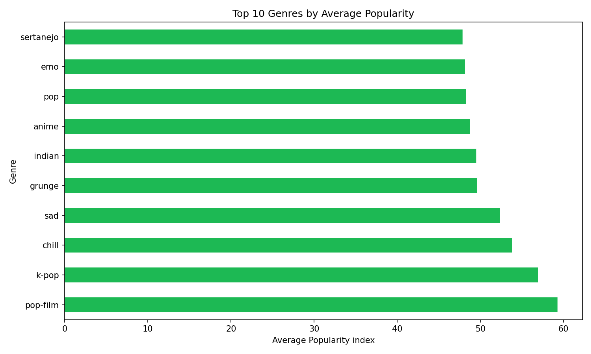
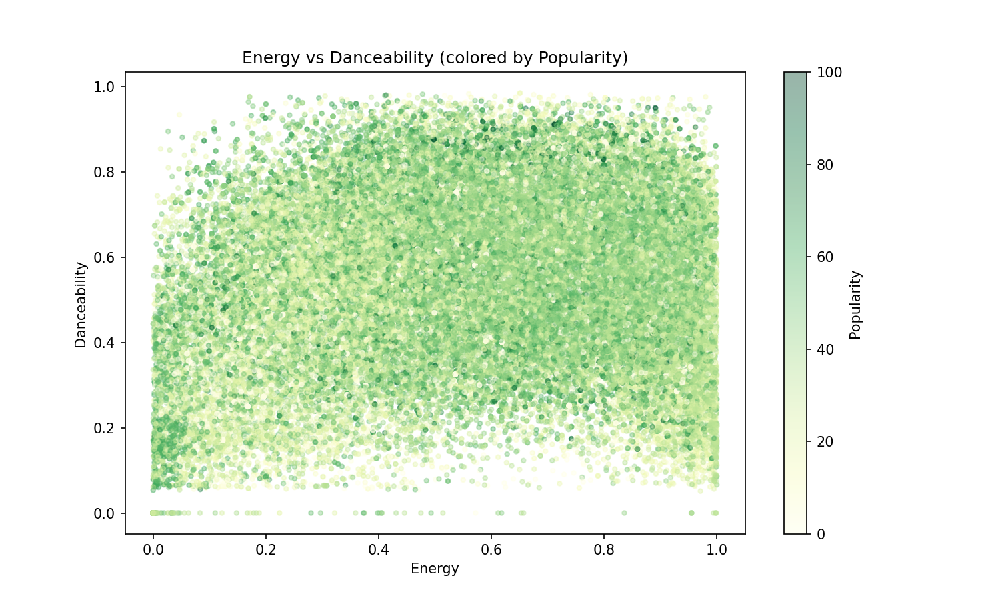
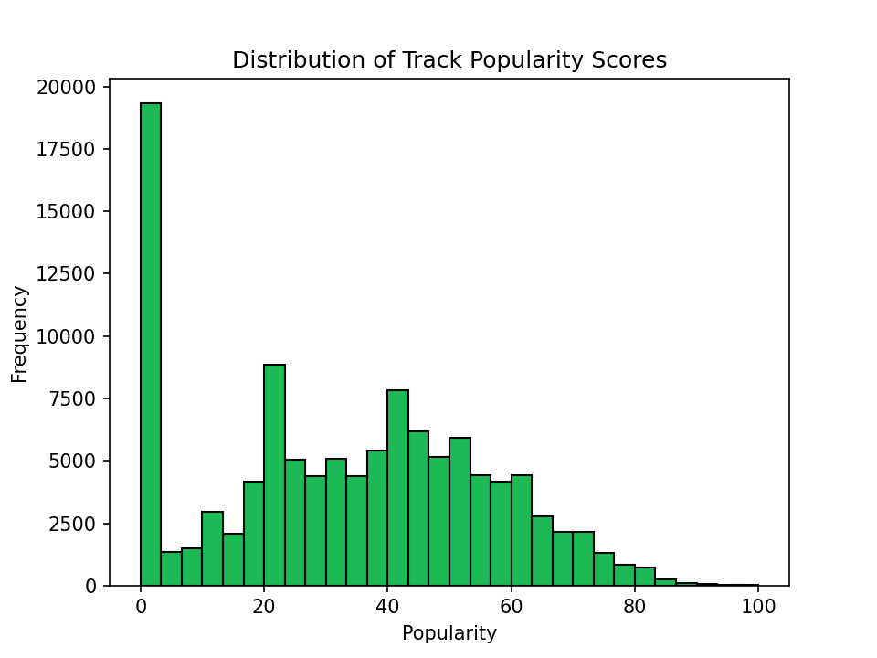

# Spotify Listening Trends Analysis

## Overview
Analyzed 114,000+ Spotify tracks to uncover genre popularity trends, 
audio feature correlations, and listener behavior patterns across 114 genres.

## Tools & Technologies
- **Python** (pandas, numpy, matplotlib) — data cleaning & visualization
- **SQL** (SQLite) — querying and aggregating insights
- **Tableau** — interactive dashboard

## Dataset
[Spotify Tracks Dataset](https://www.kaggle.com/datasets/maharshipandya/-spotify-tracks-dataset) 
— 114,000 tracks with audio features including danceability, energy, 
valence, tempo, and popularity scores.

## Project Structure
spotify-analysis/
├── notebooks/
│   ├── 01_cleaning.ipynb       # Data cleaning & feature engineering
│   ├── 02_sql_analysis.ipynb   # SQL queries & insights
│   └── 03_visualizations.ipynb # Matplotlib charts
├── output/
│   └── charts/                 # Exported visualizations
├── .gitignore
└── README.md

## Key Findings
- **Pop-film and K-pop genres average 23%+ higher popularity than the dataset mean**
- **High energy + high danceability tracks are 13% more popular on average**
- **Nearly 19,000 tracks (17% of the dataset) have a popularity score of 0, suggesting a large portion of Spotify's catalog consists of obscure or unlisted tracks with little to no streaming activity**
## Dashboard
[View Interactive Tableau Dashboard](https://public.tableau.com/views/SpotifyDataAnalysis_17834831336470/SpotifyListeningTrends)

## Charts

